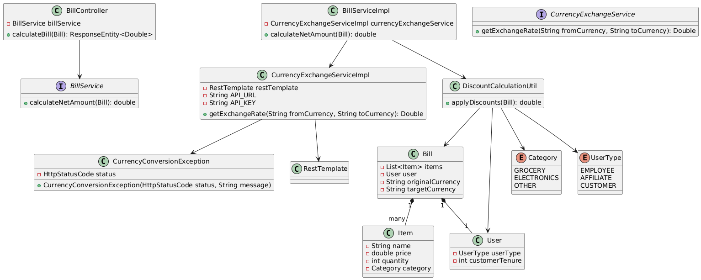

# Currency Exchange and Discount Calculation Application

This is a Spring Boot application that integrates with a third-party currency exchange API to retrieve real-time exchange rates. The application calculates the total payable amount for a bill in a specified currency after applying applicable discounts. It exposes an API endpoint to submit a bill and get the payable amount in another currency.

## Table of Contents

1. [Requirements](#requirements)
2. [Setup](#setup)
3. [Running the Application](#running-the-application)
4. [API Endpoint](#api-endpoint)
5. [Testing](#testing)
6. [Code Coverage](#code-coverage)
7. [Static Code Analysis](#static-code-analysis)
8. [Caching](#caching)
9. [Assumptions](#assumptions)

## Requirements

- Java 17 or higher
- Maven 3.x
- IntelliJ IDEA (or any other IDE)
- An API key from a currency exchange service ( [ExchangeRate-API](https://www.exchangerate-api.com/))
## UML Diagram

Below is the UML diagram representing the architecture of the Currency Exchange and Discount Calculation application:




## Setup

### Clone the Repository

```bash
git clone https://github.com/asitkr27/currency-exchange-app.git
````

### Open the Project in IntelliJ IDEA

```
Open IntelliJ IDEA.
Select File -> Open and navigate to the cloned repository folder.
IntelliJ will recognize the Maven project and load it.
```

## Running the Application

### Run the Application

```
In IntelliJ, navigate to the CurrencyExchangeApplication.java file in src/main/java/com/example/currencyexchange.
Right-click on the file and select Run 'CurrencyExchangeApplication'.
```

### Access the Application

The application will start on port 8080 by default.

## API Endpoint

- **Method Type:** POST
- **URL:** `http://localhost:8080/api/calculate`

### Example Request Using `curl`

```bash
curl --location 'http://localhost:8080/api/calculate' \
--header 'Content-Type: application/json' \
--header 'Authorization: Basic YWRtaW46YWRtaW4=' \
--data '{
    "items": [
        {
            "name": "Laptop",
            "price": 1000.0,
            "category": "ELECTRONICS",
            "quantity": 5
        },
        {
            "name": "Apple",
            "price": 10.0,
            "category": "GROCERY",
            "quantity": 10
        }
    ],
    "totalAmount": 5100.0,
    "originalCurrency": "AED",
    "targetCurrency": "INR",
    "user": {
        "userType": "EMPLOYEE",
        "customerTenure": 3
    }
}'
```

## Testing

You can write unit and integration tests using JUnit and Mockito to ensure correctness. Run tests using:

```cmd
mvn test
```

## Code Coverage

To check the test coverage, use:

```bash
mvn clean verify
```

The report will be available under `target/site/jacoco/index.html`.

## Static Code Analysis

Run static code analysis using SonarQube:

```bash
mvn sonar:sonar -Dsonar.host.url=http://localhost:9000
```

## Caching

To improve performance, caching is implemented for exchange rates using Spring Cache.

## Assumptions

- Discounts depend on the user type (`EMPLOYEE`, `AFFILIATE`, `CUSTOMER`) and customer tenure.
- The total payable amount includes applicable discounts before conversion.
- The exchange rate is fetched in real-time from the third-party API.

